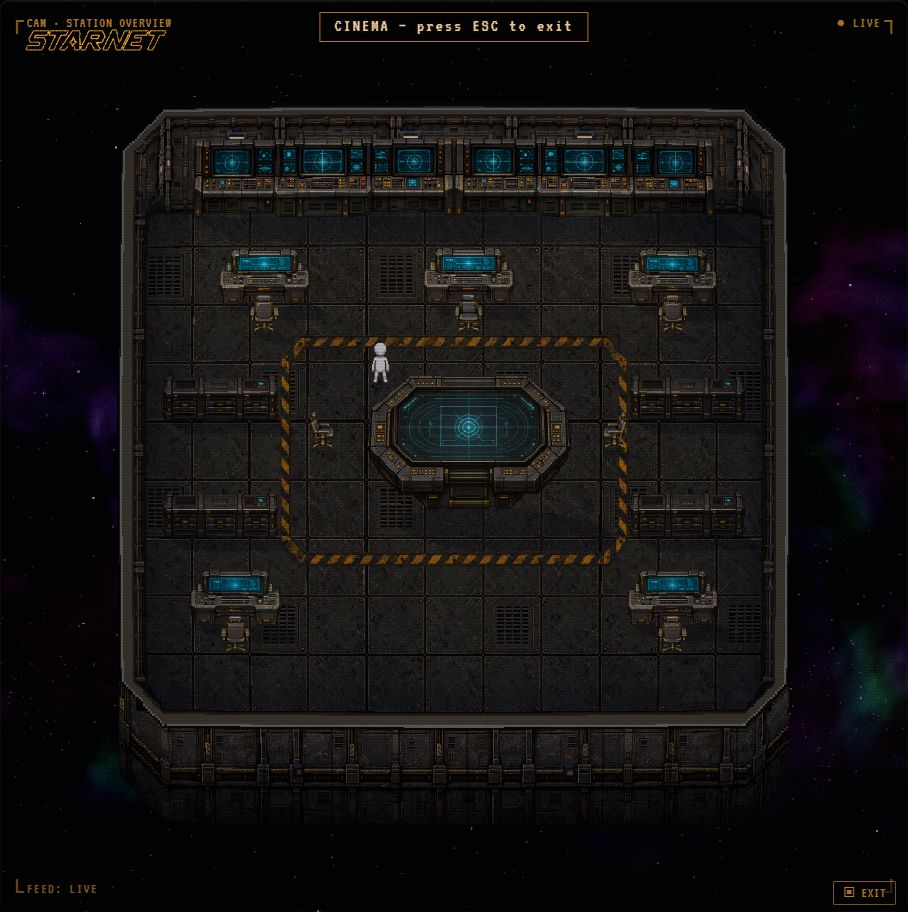

# Industrial station — furniture and materials

Open http://127.0.0.1:18792/ while the local preview is running.
Restart from this worktree with `powershell -File dev/industrial-textures/start.ps1`.
The launcher uses `node dev/seed.js --keep` with an isolated scratch station.

The two supplied reference images are the sole art direction: worn charcoal steel,
recessed fasteners and service channels, muted brass, and cyan workstation screens.
The twelve generated assets live in `frontend/assets/industrial/`: `floor.png`,
`wall.png`, `shell.png`, `workstation.png`, `workstation-compact.png`, and the three
`chair-*.png` facings, plus `tactical-table.png`, `console-bank.png`,
`equipment-bay.png` and `deck-perimeter.png`. Exact built-in imagegen prompts are
recorded in [PROMPTS.md](PROMPTS.md). The original masters remain in the local
imagegen output directory. `prepare-proportions.cjs` packages the current wall,
wide console and broad chair views. It removes the generated connected background
matte, trims the sprites and resizes them without stretching their silhouettes.

The industrial materials now load by default. `?textures=classic` retains the
original renderer for comparison; the former `?textures=industrial` URL still works.
It replaces floor and wall painting, the default station shell, and the desk/dual
desk artwork, automatic workstation seats, and placeable office chairs in all four
orientations and their mirrors. The 22 × 18 command deck has five actual workstations,
one assigned to NOVA, six placeable chairs, two contiguous north-wall console banks,
a central tactical table, four equipment bays and a walkable hazard perimeter.
The four new designs are available in Refit's decoration catalog. Their displays
are decorative navigation art, not live harness telemetry; they grant no tools.
The console banks require a north wall. Their saved footprints are 9 × 1 tiles;
the table is 7 × 4, cabinets 4 × 1, and floor perimeter 12 × 8.
All 309 free deck tiles in this composition remain reachable. Other furniture
families (including diner and pod chairs) and characters remain outside this pass.

Newly placed broad single-operator consoles occupy three actual tiles instead of two.
Its art retains its source aspect ratio and approximately 23.3 world-pixel height,
and contact the original floor line. Existing two-tile desks keep their saved
footprints and use the matching compact body at the same height, so loading a save
cannot overlap neighboring furniture. The side chairs are centered under their
desks. Chairs retain their 16-pixel height with broader seats and armrests,
black upholstery, worn brass,
and the same source pixels for occupied-seat rims. The industrial lighting's
fixture tint is 0.04, live-compared in the CRT lab against the previous 0.16 wash.
The ordinary edition retains its original lighting.

The floor, walls, corners and shell use cached visual plates at up to 6× resolution.
The existing base canvas remains authoritative for geometry, occlusion, picking,
lights and masks. A single broad wall bay wraps around the corners at matching
resolution. Nested shell layers preserve the detailed art through their original
ownership masks. Refit uses the same material art. All twelve assets must load
before the pack activates; a missing asset retains the complete original look.

This local preview has no provider credentials configured. The station renderer,
editing and backend are running; model replies require signing in or configuring
a provider in this preview. The installed desktop application is a separate build.

Verification receipts are in [VERIFICATION.md](VERIFICATION.md).

The command-deck composition only changes this isolated preview, not customer
saves. `command-deck.cjs` is the reproducible layout; the launcher preserves any
existing saved station. [BRIDGE_PROMPTS.md](BRIDGE_PROMPTS.md) records the new
built-in imagegen prompts. `prepare-bridge.cjs` packages the transparent masters.

