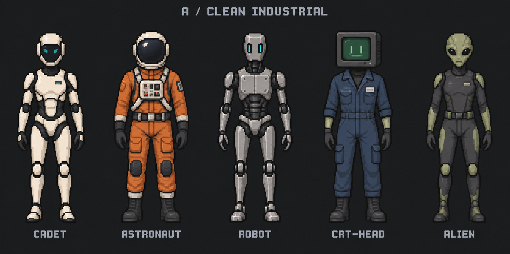
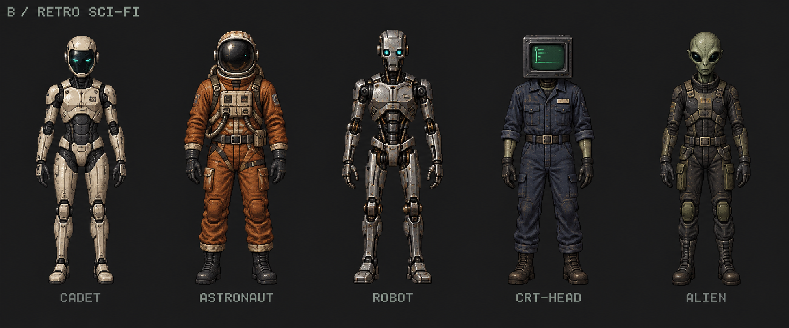
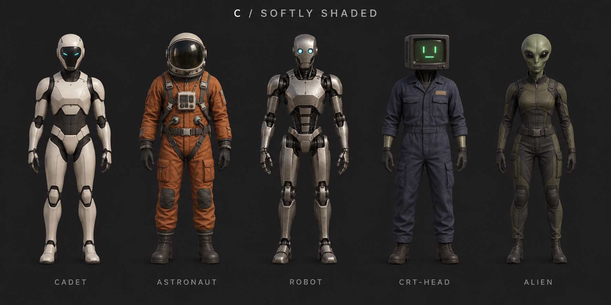

# Agent front-view style studies

The same five agents in three styles: Cadet, Astronaut, Robot, CRT-head and Alien. Fifteen front-view concepts, presented as three comparison sheets. Generated with built-in image_gen; prompts are in prompts.json. These are visual direction studies, not production animation frames.

## A — Clean industrial

Simple pixel clusters, restrained palettes and clear material blocks.

## B — Detailed retro sci-fi

Weathered surfaces, richer texture and an older science-fiction RPG feel.

## C — Softly shaded

Smooth shading, rounded surfaces and a pre-rendered game appearance.

